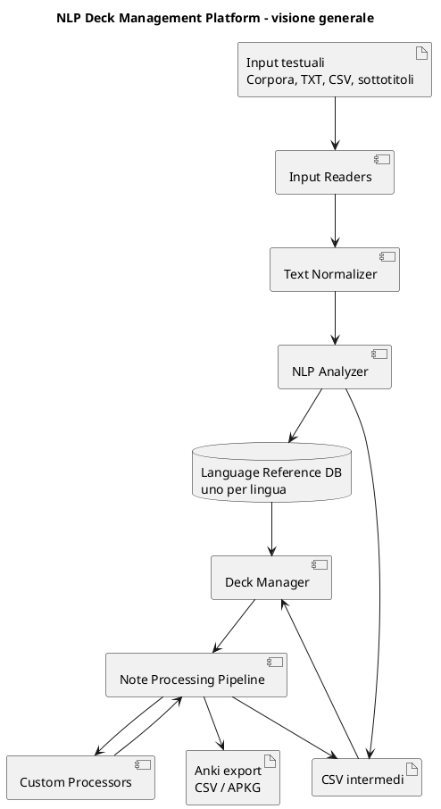
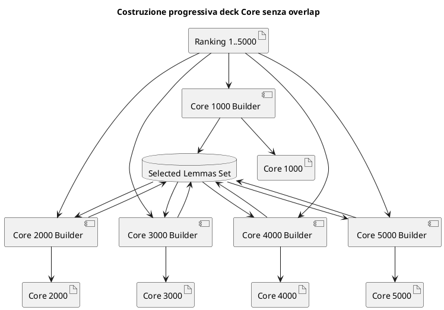
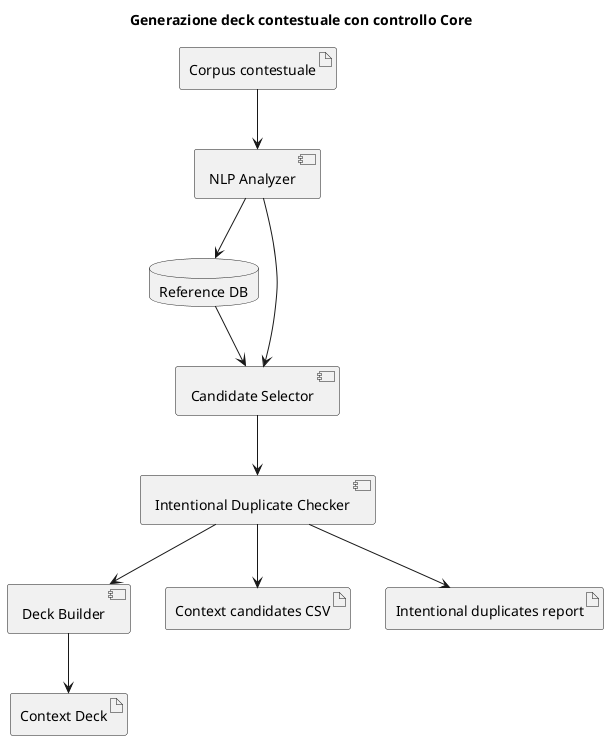
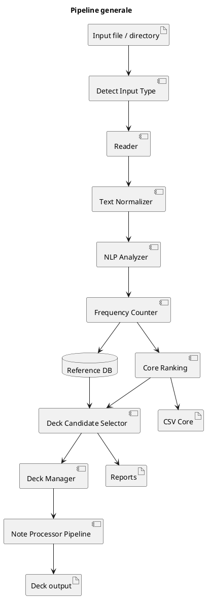
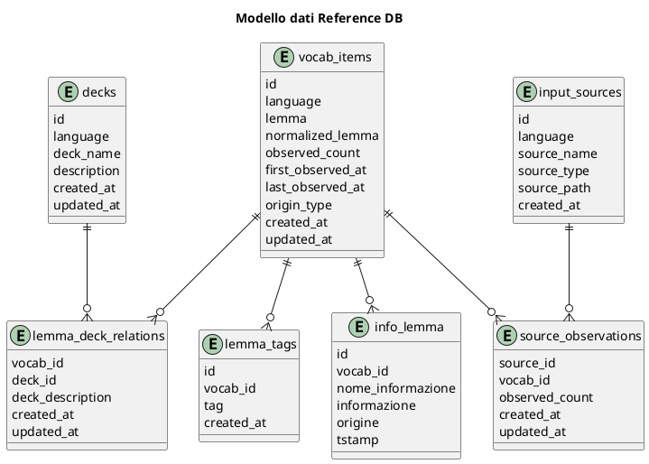
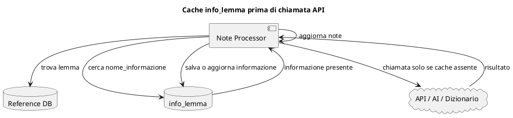
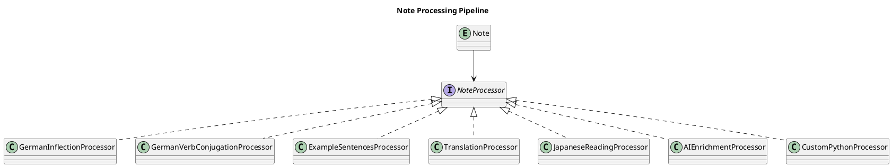

# NLP Deck Management Platform - Documentazione architetturale

Versione documento: 0.5

## Scopo del documento

Questo documento descrive l'architettura aggiornata della piattaforma per la gestione di deck linguistici.

Il sistema è primariamente un gestore di deck linguistici.

L'obiettivo principale è creare, aggiornare, completare, correggere e arricchire deck di alta qualità, evitando ridondanze accidentali e consentendo solo ridondanze intenzionali, documentate e verificabili.

Il Reference DB è uno strumento di supporto alla qualità dei deck. Non è il prodotto finale del sistema. Serve a mantenere una memoria globale, per lingua, dei lemmi osservati, dei lemmi importati, delle relazioni con i deck, dei tag globali e delle informazioni linguistiche già ottenute tramite API, dizionari, AI o revisione manuale.

Le lingue di interesse primario sono:

- Tedesco, codice lingua `de`
- Giapponese, codice lingua `ja`

La struttura deve rimanere sufficientemente generale da poter supportare altre lingue.

## Obiettivo generale del sistema

Il sistema deve supportare:

- creazione di deck nuovi
- aggiunta di notes a deck esistenti
- analisi di deck esistenti
- completamento di notes incomplete
- correzione di notes già presenti
- arricchimento automatico o semi-automatico delle notes
- elaborazione tramite codice custom
- chiamate a traduttori, dizionari online, AI e altre API
- caching persistente dei risultati delle chiamate
- generazione di deck Core generali
- generazione di deck contestuali
- riduzione delle duplicazioni accidentali
- tracciamento delle duplicazioni intenzionali
- esportazione CSV UTF-8 con header
- esportazione finale verso Anki

## Principio architetturale centrale

Il sistema deve essere progettato intorno ai deck e alle notes.

Il Reference DB è un servizio interno persistente.

Il Reference DB serve a:

- sapere quali lemmi sono già noti
- sapere quali lemmi sono già stati osservati nei testi
- sapere se un lemma è già stato associato a uno o più deck
- evitare duplicazioni non desiderate
- registrare duplicazioni intenzionali
- memorizzare informazioni già ottenute su un lemma
- evitare chiamate ripetute a API o servizi esterni
- supportare la generazione di deck Core e deck contestuali
- supportare report e controlli di qualità

Il Reference DB non deve essere considerato una copia sempre sincronizzata dei deck Anki esistenti.

Per semplicità, quando un lemma viene rimosso da un deck, il Reference DB non viene aggiornato automaticamente.

Di conseguenza, la relazione lemma-deck indica che il lemma è stato registrato come associato a quel deck, non necessariamente che il lemma sia ancora presente nel deck in quel momento.

## Visione generale

## Tipi di deck

### Deck Core generali

I deck Core generali rappresentano fasce progressive di vocabolario generale.

Deck previsti:

- Core 1000
- Core 2000
- Core 3000
- Core 4000
- Core 5000

I deck Core devono essere costruiti senza replicazioni tra fasce.

Significato operativo:

    Core 1000
        contiene i lemmi dal rank 1 al rank 1000

    Core 2000
        contiene i lemmi dal rank 1001 al rank 2000
        non contiene lemmi già presenti in Core 1000

    Core 3000
        contiene i lemmi dal rank 2001 al rank 3000
        non contiene lemmi già presenti in Core 1000 o Core 2000

    Core 4000
        contiene i lemmi dal rank 3001 al rank 4000
        non contiene lemmi già presenti in Core 1000, 2000 o 3000

    Core 5000
        contiene i lemmi dal rank 4001 al rank 5000
        non contiene lemmi già presenti in Core 1000, 2000, 3000 o 4000

Quindi i nomi Core 2000, Core 3000, Core 4000 e Core 5000 indicano fasce successive da 1000 lemmi, non liste cumulative.

Per evitare ambiguità, il sistema può produrre sia nomi compatibili con lo script storico sia nomi espliciti.

Nomi compatibili:

    core_1000_de.csv
    core_2000_de.csv
    core_3000_de.csv
    core_4000_de.csv
    core_5000_de.csv

Nomi espliciti consigliati:

    core_0001_1000_de.csv
    core_1001_2000_de.csv
    core_2001_3000_de.csv
    core_3001_4000_de.csv
    core_4001_5000_de.csv

### Deck contestuali

I deck contestuali coprono ambiti specifici.

Esempi:

- lavoro informatico
- relazioni personali
- viaggi
- scuola
- colloqui di lavoro
- email professionali
- conversazione quotidiana
- lettura tecnica
- cucina
- salute
- vita familiare
- pratiche amministrative

Regola fondamentale:

Un deck contestuale deve contenere preferibilmente parole non già presenti nei deck Core generali.

Se una parola già presente in un deck Core viene inserita anche in un deck contestuale, la duplicazione deve essere intenzionale e tracciata nella relazione lemma-deck.

Esempio:

    Lemma:
        arbeiten

    Già presente in:
        German Core 1000

    Inserito anche in:
        German IT Work

    Descrizione relazione:
        Duplicazione intenzionale; verbo centrale nel contesto lavorativo informatico

## Costruzione progressiva dei deck Core senza replicazioni

### Obiettivo

Costruire una sequenza di deck Core indipendenti e non sovrapposti.

Il risultato desiderato è:

    Core 1000
        primi 1000 lemmi

    Core 2000
        secondi 1000 lemmi

    Core 3000
        terzi 1000 lemmi

    Core 4000
        quarti 1000 lemmi

    Core 5000
        quinti 1000 lemmi

Nessun lemma deve essere ripetuto tra le fasce Core.

### Input

Input principali:

- corpus generale
- file di sottotitoli
- file di testo
- ranking generato dalla pipeline NLP

Formato intermedio principale:

    core_0001_5000_<lang>.csv

Campi:

    rank,lemma,frequency,core_band,language

### Algoritmo

    inizializzare insieme vuoto already_selected

    per ogni fascia Core:
        selezionare il range di rank corrispondente
        per ogni lemma nel range:
            normalizzare lemma
            se lemma non è in already_selected:
                aggiungere lemma alla fascia corrente
                aggiungere lemma ad already_selected
            altrimenti:
                registrare errore o warning nel report overlap

### Diagramma

### Output

Output principali:

    core_0001_5000_<lang>.csv
    core_1000_<lang>.csv
    core_2000_<lang>.csv
    core_3000_<lang>.csv
    core_4000_<lang>.csv
    core_5000_<lang>.csv

Output espliciti consigliati:

    core_0001_1000_<lang>.csv
    core_1001_2000_<lang>.csv
    core_2001_3000_<lang>.csv
    core_3001_4000_<lang>.csv
    core_4001_5000_<lang>.csv

Report consigliato:

    core_overlap_report_<lang>.csv

Campi consigliati:

    lemma,normalized_lemma,first_core_band,duplicate_core_band,action

Valori possibili per action:

    ok
    skipped_duplicate
    warning
    error

## Generazione dei deck contestuali

### Obiettivo

Costruire deck specifici per contesto evitando di duplicare automaticamente lemmi già presenti nei deck Core.

Formula concettuale:

    deck contestuale =
        parole rilevanti per il contesto
        meno parole già coperte dai deck Core
        più duplicazioni intenzionali documentate

### Input

Possibili input:

- corpus di dominio
- sottotitoli di contesto
- testi tecnici
- liste manuali
- CSV preparati
- deck esistenti da analizzare

### Regola di selezione

Per ogni lemma candidato:

    controllare se il lemma è già presente nel Reference DB

    controllare se il lemma è già associato a deck Core

    se non è presente nei deck Core:
        il lemma è candidabile per il deck contestuale

    se è già presente nei deck Core:
        il lemma viene escluso, salvo duplicazione intenzionale

    se la duplicazione è intenzionale:
        il lemma viene incluso
        viene registrata una relazione lemma-deck
        viene compilato deck_description con motivazione esplicita

### Diagramma

### Output

Output consigliati:

    contextual_deck_candidates_<lang>.csv
    contextual_deck_selected_<lang>.csv
    intentional_duplicates_report_<lang>.csv
    contextual_deck_anki_source_<lang>.csv

Campi consigliati per contextual_deck_candidates:

    lemma
    normalized_lemma
    frequency
    already_in_reference_db
    already_in_core
    already_in_other_decks
    selected
    reason

Campi consigliati per intentional_duplicates_report:

    lemma
    normalized_lemma
    deck_name
    already_in_deck
    duplicate_with_core
    intentional
    deck_description

## Pipeline generale

## Formati di input

### Leipzig Corpora Collection

Formato:

    .tar.gz

Contenuto atteso:

    sentences.txt

Formato riga tipico:

    ID<TAB>frase

Il reader deve estrarre la frase e ignorare l'identificatore.

### File testo

Formati:

    .txt

Contenuto accettato:

- una frase per riga
- paragrafi
- righe in formato Leipzig

### File CSV

Formato:

    .csv

Uso previsto:

- liste di lemmi
- liste di parole candidate
- dati esportati da altre pipeline
- liste manuali

La prima versione può supportare una colonna testuale predefinita o configurabile.

### Sottotitoli

Formati iniziali:

    .srt
    .vtt
    .ass
    .ssa

Elementi da rimuovere:

- timestamp
- numerazione
- markup
- stili
- metadati tecnici

Output dei reader:

    Iterable[str]

Esempio per tedesco:

    Das ist ein Beispiel.
    Heute gehen wir nach Hause.

Esempio per giapponese:

    私は学校に行きます。
    仕事が終わりました。

## NLP per lingua

### Tedesco

Per il tedesco il sistema deve supportare:

- tokenizzazione
- lemmatizzazione
- normalizzazione maiuscole/minuscole
- riconoscimento base della parte del discorso, se disponibile
- preparazione dati per articolo, genere, plurale e flessione
- preparazione dati per coniugazione dei verbi

Output linguistici desiderati per parole tedesche:

- lemma
- articolo
- genere
- plurale
- flessione completa con articoli
- parte del discorso
- traduzione italiana
- 5 frasi semplici, colloquiali e frequenti
- traduzione delle frasi

Output linguistici desiderati per verbi tedeschi:

- lemma
- ausiliare, se utile
- verbo separabile o non separabile, se utile
- coniugazione completa
- traduzione italiana
- 5 frasi semplici, colloquiali e frequenti
- traduzione delle frasi

Queste informazioni non devono essere inventate dal codice vanilla. Devono essere ottenute da processor custom, dizionari, API, AI o revisione manuale.

### Giapponese

Per il giapponese il sistema deve supportare:

- segmentazione morfologica
- forma dizionario
- lettura
- distinzione possibile tra kanji, kana e forma normalizzata
- supporto futuro a furigana
- supporto futuro a livello JLPT

Campi linguistici possibili:

- lemma
- forma dizionario
- kanji
- kana
- romaji
- lettura
- traduzione italiana
- parte del discorso
- frase esempio
- furigana
- traduzione frase
- livello JLPT

## Language Reference DB

### Scopo

Il Reference DB è un database SQLite specifico per lingua.

Directory predefinita:

    vocab_reference_dbs/

File predefiniti:

    vocab_reference_de.sqlite
    vocab_reference_ja.sqlite

Argomenti CLI consigliati:

    --language de
    --reference-db vocab_reference_dbs/vocab_reference_de.sqlite

    --language ja
    --reference-db vocab_reference_dbs/vocab_reference_ja.sqlite

### Contenuto

Il Reference DB contiene:

- lemmi osservati nei testi di input
- lemmi inseriti manualmente
- lemmi importati
- tag globali dei lemmi
- elenco dei deck conosciuti
- relazioni lemma-deck
- informazioni linguistiche già recuperate o calcolate per ciascun lemma
- osservazioni provenienti dalle fonti, se abilitate

### Regola obbligatoria

Ogni lemma osservato durante l'elaborazione di un input deve essere inserito o aggiornato nel Reference DB.

Il lemma può essere presente nel Reference DB anche se non è associato ad alcun deck.

Il lemma può essere presente nel Reference DB anche se non è mai stato osservato, per esempio se importato o inserito manualmente.

## Modello dati del Reference DB

### Diagramma dati principale

### Tabella vocab_items

    CREATE TABLE vocab_items (
        id INTEGER PRIMARY KEY AUTOINCREMENT,

        language TEXT NOT NULL,

        lemma TEXT NOT NULL,
        normalized_lemma TEXT NOT NULL,

        observed_count INTEGER NOT NULL DEFAULT 0,

        first_observed_at TEXT,
        last_observed_at TEXT,

        origin_type TEXT,

        created_at TEXT NOT NULL,
        updated_at TEXT NOT NULL,

        UNIQUE(language, normalized_lemma)
    );

Significato:

    language
        codice lingua

    lemma
        forma principale del lemma

    normalized_lemma
        forma normalizzata per deduplicazione

    observed_count
        numero cumulativo di osservazioni

    first_observed_at
        prima osservazione del lemma

    last_observed_at
        ultima osservazione del lemma

    origin_type
        origine iniziale, per esempio observed, manual, imported, seed

### Tabella lemma_tags

    CREATE TABLE lemma_tags (
        id INTEGER PRIMARY KEY AUTOINCREMENT,

        vocab_id INTEGER NOT NULL,
        tag TEXT NOT NULL,

        created_at TEXT NOT NULL,

        UNIQUE(vocab_id, tag),

        FOREIGN KEY(vocab_id)
            REFERENCES vocab_items(id)
            ON DELETE CASCADE
    );

I tag appartengono al lemma.

Esempi:

    noun
    verb
    common
    travel
    work
    it
    jlpt_n5
    a1
    separable_verb
    irregular_verb

### Tabella decks

    CREATE TABLE decks (
        id INTEGER PRIMARY KEY AUTOINCREMENT,

        language TEXT NOT NULL,

        deck_name TEXT NOT NULL,
        description TEXT,

        created_at TEXT NOT NULL,
        updated_at TEXT NOT NULL,

        UNIQUE(language, deck_name)
    );

### Tabella lemma_deck_relations

    CREATE TABLE lemma_deck_relations (
        vocab_id INTEGER NOT NULL,
        deck_id INTEGER NOT NULL,

        deck_description TEXT,

        created_at TEXT NOT NULL,
        updated_at TEXT NOT NULL,

        PRIMARY KEY(vocab_id, deck_id),

        FOREIGN KEY(vocab_id)
            REFERENCES vocab_items(id)
            ON DELETE CASCADE,

        FOREIGN KEY(deck_id)
            REFERENCES decks(id)
            ON DELETE CASCADE,

        CHECK (
            deck_description IS NULL
            OR length(deck_description) <= 255
        )
    );

Il campo deck_description deve essere usato per documentare il significato della presenza del lemma nel deck.

Esempi:

    Presente nel Core 1000
    Card principale della lezione 3
    Duplicazione intenzionale per rinforzo
    Termine centrale nel contesto lavoro informatico
    Presente solo come frase esempio
    Da verificare: possibile duplicato

### Tabella info_lemma

La tabella info_lemma memorizza informazioni linguistiche o didattiche già ottenute per un lemma.

Serve soprattutto a evitare chiamate ripetute a API, dizionari online, AI o altri servizi esterni.

    CREATE TABLE info_lemma (
        id INTEGER PRIMARY KEY AUTOINCREMENT,

        vocab_id INTEGER NOT NULL,

        nome_informazione TEXT NOT NULL,

        informazione TEXT NOT NULL,

        origine TEXT,

        tstamp TEXT NOT NULL,

        UNIQUE(vocab_id, nome_informazione),

        FOREIGN KEY(vocab_id)
            REFERENCES vocab_items(id)
            ON DELETE CASCADE
    );

Campi:

    vocab_id
        riferimento al lemma

    nome_informazione
        stringa libera che identifica il tipo di informazione

    informazione
        testo libero potenzialmente lungo

    origine
        descrizione libera di come è stata ottenuta l'informazione

    tstamp
        data e ora dell'ultima creazione o aggiornamento della riga

Esempi di nome_informazione:

    flessione
    coniugazione
    frasi_esempio
    traduzione
    articolo
    genere
    plurale
    lettura
    furigana
    jlpt
    note_grammaticali

Esempi di origine:

    manuale
    revisione docente
    API dizionario
    sito Duden
    sito Wiktionary
    OpenAI
    DeepL
    Jisho
    JMdict
    custom processor

Il campo informazione deve essere di tipo TEXT.

Può contenere:

- testo libero
- JSON
- markdown semplice
- risultato completo di una chiamata
- coniugazione completa di un verbo
- flessione completa di un sostantivo
- elenco di frasi esempio
- dati strutturati da convertire in note Anki

Esempio di contenuto JSON per un verbo tedesco:

    {
      "lemma": "arbeiten",
      "tipo": "verbo",
      "traduzione_it": "lavorare",
      "coniugazione": {
        "praesens": {
          "ich": "arbeite",
          "du": "arbeitest",
          "er_sie_es": "arbeitet",
          "wir": "arbeiten",
          "ihr": "arbeitet",
          "sie_Sie": "arbeiten"
        }
      },
      "frasi_esempio": [
        {
          "de": "Ich arbeite heute von zu Hause.",
          "it": "Oggi lavoro da casa."
        }
      ]
    }

Nota sul vincolo UNIQUE:

Il vincolo consigliato è:

    UNIQUE(vocab_id, nome_informazione)

Questo rende la tabella una cache semplice: per ogni lemma e per ogni tipo di informazione esiste una sola versione corrente.

Se in futuro sarà necessario mantenere più versioni della stessa informazione da origini diverse, si potrà modificare il vincolo in:

    UNIQUE(vocab_id, nome_informazione, origine)

oppure introdurre una tabella storica separata.

### Tabella input_sources

    CREATE TABLE input_sources (
        id INTEGER PRIMARY KEY AUTOINCREMENT,

        language TEXT NOT NULL,

        source_name TEXT NOT NULL,
        source_type TEXT NOT NULL,
        source_path TEXT,

        created_at TEXT NOT NULL
    );

Esempi di source_type:

    leipzig_tar
    plain_text
    csv
    srt
    vtt
    ass
    ssa
    manual_import
    deck_import

### Tabella source_observations

    CREATE TABLE source_observations (
        source_id INTEGER NOT NULL,
        vocab_id INTEGER NOT NULL,

        observed_count INTEGER NOT NULL DEFAULT 0,

        created_at TEXT NOT NULL,
        updated_at TEXT NOT NULL,

        PRIMARY KEY(source_id, vocab_id),

        FOREIGN KEY(source_id)
            REFERENCES input_sources(id)
            ON DELETE CASCADE,

        FOREIGN KEY(vocab_id)
            REFERENCES vocab_items(id)
            ON DELETE CASCADE
    );

Questa tabella è utile per sapere da quali fonti arriva un lemma.

Può essere opzionale nella prima versione.

## Cache info_lemma e chiamate API

### Problema

Molti processor dovranno chiamare risorse esterne.

Esempi:

- dizionari online
- traduttori
- servizi AI
- API linguistiche
- database lessicali
- strumenti di generazione esempi

Senza cache, lo stesso lemma potrebbe causare molte chiamate ripetute, con spreco di tempo, costi e possibili limiti API.

### Soluzione

Prima di effettuare una chiamata esterna, il processor deve consultare la tabella info_lemma.

Flusso:

    dato un lemma
    dato un nome_informazione

    cercare in info_lemma

    se l'informazione esiste:
        usare l'informazione salvata
        evitare la chiamata esterna

    se l'informazione non esiste:
        effettuare la chiamata esterna
        salvare il risultato in info_lemma
        usare il risultato salvato

### Diagramma

### Esempio operativo

Per completare un verbo tedesco:

    lemma:
        arbeiten

    nome_informazione:
        coniugazione

    ricerca:
        info_lemma(vocab_id=arbeiten, nome_informazione=coniugazione)

    se presente:
        usare JSON salvato

    se assente:
        chiamare processor custom
        ottenere coniugazione
        salvare in info_lemma
        aggiornare la note

## Note Processing Pipeline

### Scopo

La Note Processing Pipeline è il meccanismo che consente di completare, correggere e arricchire notes.

La pipeline deve supportare codice custom.

Il codice custom potrà:

- leggere una note
- modificare una note
- leggere il Reference DB
- scrivere nel Reference DB
- leggere info_lemma
- scrivere info_lemma
- chiamare API esterne
- generare warning
- generare log
- fallire senza bloccare tutta la lavorazione, se configurato

### Interfaccia logica

    class NoteProcessor:

        def process(
            self,
            note,
            context
        ):
            pass

### Context

Il context passato al processor dovrebbe contenere:

    language
    deck_name
    reference_db
    logger
    config
    cache
    dry_run
    output_dir

### ProcessingResult

Un processor dovrebbe restituire un risultato strutturato.

Campi consigliati:

    success
    changed
    warnings
    errors
    updated_fields
    cached_hits
    external_calls

### Diagramma

### Processor previsti per il tedesco

Processor vanilla o custom:

- GermanArticleProcessor
- GermanNounInflectionProcessor
- GermanVerbConjugationProcessor
- GermanExampleSentencesProcessor
- GermanTranslationProcessor
- GermanGrammarNotesProcessor

Funzione desiderata:

- recuperare articolo
- recuperare genere
- recuperare plurale
- recuperare flessione completa con articoli
- recuperare coniugazione completa dei verbi
- produrre 5 frasi colloquiali frequenti
- produrre traduzione italiana
- compilare i campi della note

### Processor previsti per il giapponese

Processor vanilla o custom:

- JapaneseReadingProcessor
- JapaneseDictionaryFormProcessor
- JapaneseFuriganaProcessor
- JapaneseExampleSentencesProcessor
- JapaneseTranslationProcessor
- JapaneseJlptProcessor

Funzione desiderata:

- recuperare lettura
- recuperare forma dizionario
- recuperare furigana
- recuperare traduzione
- produrre frasi esempio
- classificare JLPT, se possibile
- compilare i campi della note

## Gestione notes

### Note come dati flessibili

Le notes devono poter avere strutture diverse a seconda della lingua e del modello.

Per questo conviene rappresentare i campi della note come struttura flessibile, per esempio JSON.

Esempio tedesco:

    {
      "lemma": "Haus",
      "article": "das",
      "gender": "neuter",
      "plural": "Häuser",
      "translation_it": "casa",
      "inflection": "...",
      "example_1_de": "Ich bin zu Hause.",
      "example_1_it": "Sono a casa."
    }

Esempio giapponese:

    {
      "lemma": "食べる",
      "dictionary_form": "食べる",
      "reading": "たべる",
      "romaji": "taberu",
      "translation_it": "mangiare",
      "example_1_ja": "朝ごはんを食べます。",
      "example_1_it": "Mangio la colazione."
    }

### Stati possibili di una note

Stati consigliati:

    draft
    incomplete
    enriched
    reviewed
    exported
    needs_review
    error

## Output intermedi

### Testo normalizzato

    normalized_text_units.txt

Serve a verificare che i reader abbiano pulito correttamente input, sottotitoli o corpus.

### Frequenze complete

    lemma_frequencies_full_<lang>.csv

Formato:

    lemma,frequency,language

### Ranking Core

    core_0001_5000_<lang>.csv

Formato:

    rank,lemma,frequency,core_band,language

### Fasce Core

    core_1000_<lang>.csv
    core_2000_<lang>.csv
    core_3000_<lang>.csv
    core_4000_<lang>.csv
    core_5000_<lang>.csv

Nomi espliciti:

    core_0001_1000_<lang>.csv
    core_1001_2000_<lang>.csv
    core_2001_3000_<lang>.csv
    core_3001_4000_<lang>.csv
    core_4001_5000_<lang>.csv

### Report Reference DB

    reference_db_import_report_<lang>.csv

Campi consigliati:

    lemma
    normalized_lemma
    action
    observed_count
    vocab_id

Valori action:

    inserted
    updated
    unchanged
    error

### Report Core overlap

    core_overlap_report_<lang>.csv

Serve a verificare che non ci siano sovrapposizioni tra Core 1000, 2000, 3000, 4000 e 5000.

### Report deck contestuale

    contextual_deck_candidates_<lang>.csv
    contextual_deck_selected_<lang>.csv
    intentional_duplicates_report_<lang>.csv

### Export Anki

Output CSV sorgente:

    anki_notes_source_<deck_name>_<lang>.csv

Output futuro:

    <deck_name>.apkg

## Comandi CLI consigliati

### Build Core

    python -m nlp_deck_manager.cli build-core ^
        --input data/de_corpus.srt ^
        --language de ^
        --output-dir out_de_core ^
        --max-rank 5000 ^
        --write-normalized-text ^
        --register-core-decks ^
        --run-default-processors

### Build Context

    python -m nlp_deck_manager.cli build-context ^
        --input data/de_it_work.txt ^
        --language de ^
        --deck-name "German IT Work" ^
        --output-dir out_de_it_work ^
        --intentional-duplicates-csv data/intentional_duplicates_de.csv ^
        --run-default-processors

### Lettura info_lemma

    python -m nlp_deck_manager.cli lemma-info-get ^
        --language de ^
        --lemma arbeiten ^
        --info-name coniugazione

### Scrittura info_lemma

    python -m nlp_deck_manager.cli lemma-info-set ^
        --language de ^
        --lemma arbeiten ^
        --info-name coniugazione ^
        --origin "revisione manuale" ^
        --info-file data/arbeiten_coniugazione.json

## Struttura del progetto

Struttura consigliata:

    nlp_deck_manager/

        cli.py

        readers/
            __init__.py
            base.py
            detect.py
            leipzig.py
            plaintext.py
            csv_reader.py
            subtitles.py

        normalizers/
            __init__.py
            text.py

        nlp/
            __init__.py
            base.py
            spacy_analyzer.py
            fallback_analyzer.py
            german.py
            japanese.py

        reference_db/
            __init__.py
            db.py
            schema.py
            lemma_info.py

        decks/
            __init__.py
            core_builder.py
            context_builder.py
            deck_manager.py

        notes/
            __init__.py
            note.py
            note_models.py
            exporters.py

        processors/
            __init__.py
            base.py
            default.py
            cached_lemma_info.py
            german.py
            japanese.py
            custom_loader.py

        reports/
            __init__.py
            csv_reports.py

        utils/
            __init__.py
            logging_utils.py
            paths.py
            timestamps.py

        examples/

        tests/

## Priorità implementative

### Versione 1

Obiettivi:

- lettura input
- normalizzazione testo
- NLP base
- Reference DB SQLite
- info_lemma
- CSV Core
- Core senza overlap
- deck contestuali con filtro Core
- report principali
- processor vanilla
- export CSV per Anki

### Versione 2

Obiettivi:

- import deck Anki esistenti
- modifica notes esistenti
- processor custom più avanzati
- cache API effettiva
- report qualità notes
- gestione manuale duplicazioni intenzionali

### Versione 3

Obiettivi:

- esportazione APKG completa
- sincronizzazione più fine con deck esistenti
- audit del Reference DB rispetto ai deck reali
- supporto più ricco per giapponese
- integrazione stabile con dizionari e AI

## Principi progettuali

1. Il sistema è centrato sui deck linguistici.
2. Il Reference DB è uno strumento di supporto, non il prodotto finale.
3. Tutti i lemmi osservati devono essere inseriti o aggiornati nel Reference DB.
4. Il Reference DB può contenere anche lemmi non osservati.
5. I tag appartengono al lemma.
6. La relazione lemma-deck serve a documentare la presenza del lemma in un deck.
7. La relazione lemma-deck contiene una descrizione libera di massimo 255 caratteri.
8. La rimozione di un lemma da un deck non aggiorna automaticamente il Reference DB.
9. La tabella info_lemma serve a evitare chiamate ripetute a API e servizi esterni.
10. Le informazioni complesse possono essere salvate in info_lemma come TEXT, preferibilmente JSON.
11. I deck Core devono essere costruiti senza overlap tra fasce.
12. I deck contestuali devono evitare duplicati Core non intenzionali.
13. Le duplicazioni intenzionali devono essere tracciate.
14. Il codice custom deve poter lavorare sulle notes.
15. Ogni output intermedio importante deve essere ispezionabile in CSV UTF-8.
16. La generazione Anki deve essere separata dalla fase NLP.
17. Le chiamate API reali devono essere isolate nei processor e protette da cache.
18. Il sistema deve essere flessibile per tedesco e giapponese, ma non hardcoded solo per queste lingue.
